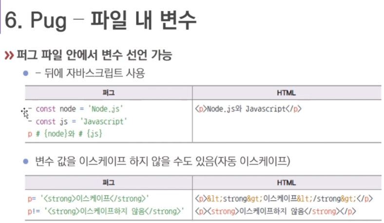

# Template Engine
템플릿 엔진은 HTML의 정적인 단점을 개선한다.
- 반복문, 조건문, 변수 등을 사용할 수 있다.
- 동적인 페이지 작성이 가능하다.
- PHP, JSP와 유사하다.

## PUG(구 Jade)
문법이 Ruby와 비슷해 코드 양이 많이 줄어든다.
- HTML과 많이 달라 호불호가 갈림
- 익스프레스에 app.set으로 퍼그 연결

```
app.set('views', path.join(__dirname, 'views'));
app.set('view engine', 'pug');
```





## Nunjucks
- 확장자는 html 또는 njk

```
 const nunjucks = require('nunjucks');
 ...
 ...
 app.set('view engine', 'html');

 nunjucks.configure('views', {
  express: app,
  watch: true,
 });
```


