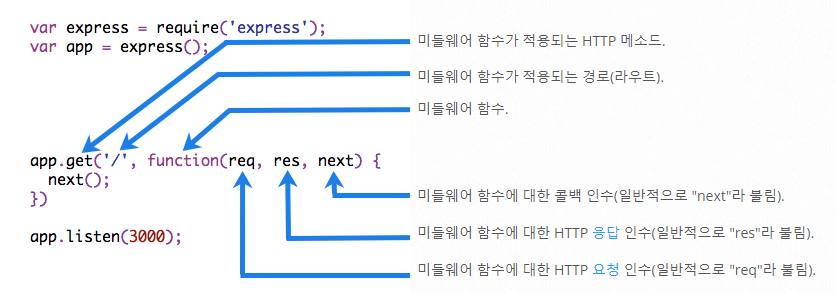
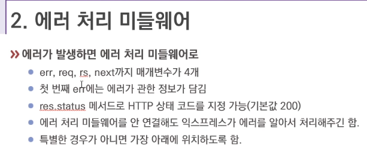
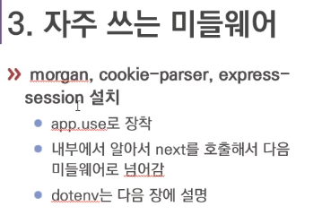

# MiddleWare

> 미들웨어 함수는 요청 오브젝트(req), 응답 오브젝트 (res), 그리고 애플리케이션의 요청-응답 주기 중 그 다음의 미들웨어 함수 대한 액세스 권한을 갖는 함수입니다. 그 다음의 미들웨어 함수는 일반적으로 next라는 이름의 변수로 표시됩니다.

미들웨어 함수는 다음과 같은 Task를 수행할 수 있습니다.
- 모든 코드를 실행.
- 요청 및 응답 오브젝트에 대한 변경을 실행.
- 요청-응답 주기를 종료.
- 스택 내의 그 다음 미들웨어를 호출.



```
//app.use가 Middleware가 아니라 함수 부분이 Middleware이다.(Middleware를 app에다 장착시킨것!)
app.use((req, resㅡ, next) => {
    console.log('모든 요청에 실행하고 싶어요!');
    next();
})
```  

## 에러처리 미들웨어


```
// 에러 미들웨어 : 에러 미들웨어는 반드시 매개변수 4개 다 써줘야한다.
app.use((err, req, res, next) => {
    console.error(err);
    res.send('에러났지롱~.');
})

```

## 자주 쓰는 미들웨어


---
## Appendix
Q : 미들웨어를 use에 장착을 했다고 하셨는데 혹시 그렇다면 use도 라우터라고 부를 수 있는 것일까요?

A : 라우터는 get, post, put, patch 등이 라우터입니다. use에서도 응답을 보낼 수는 있어서 라우터의 역할을 할 수는 있긴 한데 일반적으로 라우터라고 부르지는 않습니다.
