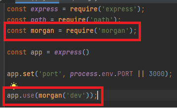

# MiddleWare

> "Middleware functions are functions that have access to the request object (req), the response object (res), and the next function in the application’s request-response cycle."

미들웨어 함수는 **req(요청) 객체**, **res(응답) 객체**, 그리고 어플리케이션 **요청-응답 사이클** 도중 그 다음의 미들웨어 함수에 대한 엑세스 권한을 갖는 함수이다.

**미들웨어**란 간단하게 말하면 클라이언트에게 요청이 오고 그 요청을 보내기 위해 응답하려는 **중간(미들)에 목적에 맞게 처리를 하는, 말하자면 거쳐가는 함수들**이라고 보면 된다.

미들웨어 함수는 다음과 같은 Task를 수행할 수 있다.
- 모든 코드를 실행.
- 요청 및 응답 오브젝트에 대한 변경을 실행.
- 요청-응답 주기를 종료.
- 스택 내의 그 다음 미들웨어를 호출.


```
//app.use가 Middleware가 아니라 함수 부분이 Middleware이다.(Middleware를 app에다 장착시킨것!)
app.use((req, resㅡ, next) => {
    console.log('모든 요청에 실행하고 싶어요!');
    next();
})
```

***

## 에러처리 미들웨어


```
// 에러 미들웨어 : 에러 미들웨어는 반드시 매개변수 4개 다 써줘야한다.
app.use((err, req, res, next) => {
    console.error(err);
    res.send('에러났지롱~.');
})

```

***

## 자주 쓰는 미들웨어


### morgan
morgan은 요청과 응답을 기록하는 미들웨어이다.




***

## Appendix
Q : 미들웨어를 use에 장착을 했다고 하셨는데 혹시 그렇다면 use도 라우터라고 부를 수 있는 것일까요?

A : 라우터는 get, post, put, patch 등이 라우터입니다. use에서도 응답을 보낼 수는 있어서 라우터의 역할을 할 수는 있긴 한데 일반적으로 라우터라고 부르지는 않습니다.


***

### reference
https://psyhm.tistory.com/8?category=654716