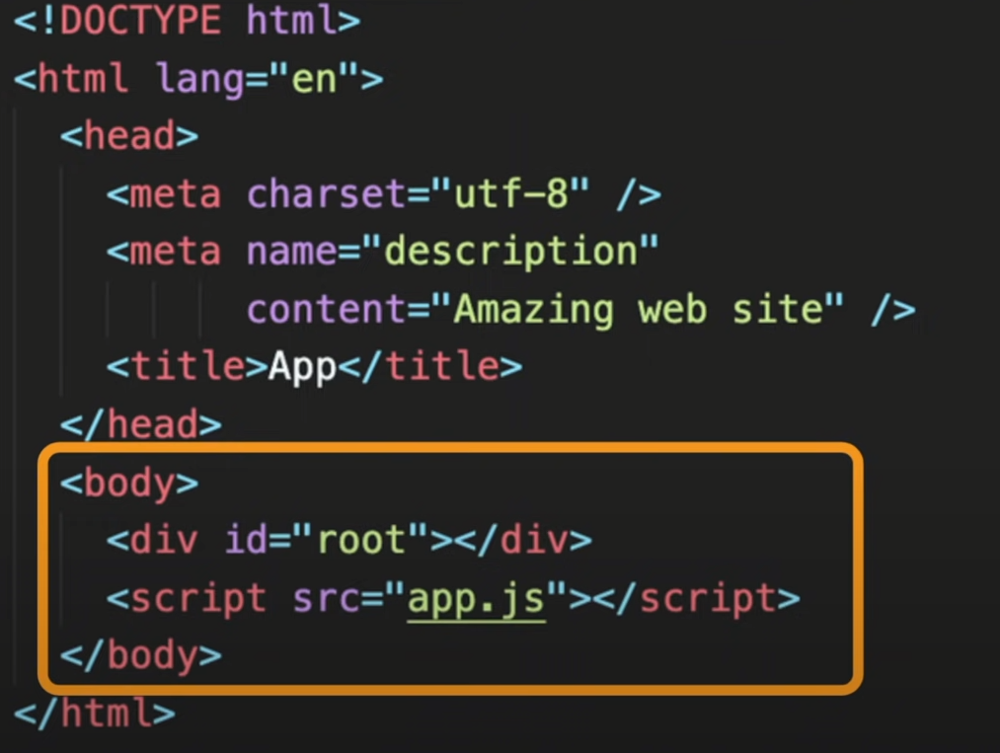
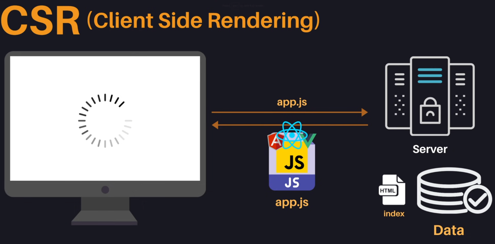

# SSR, CSR, SSG

## WEB의 역사  

- 1990년 중반까지 모든 WEB 어플리케이션은 **static sites** 였다.
>**static sites란?**  
>사용자가 브라우저에서 www.hello.com과 같은 주소로 접속하면 서버에 이미 배포된 HTML 문서를 받아와서 보여주는 형식이다.   
>한 가지 문제점은 페이지 내에서 다른 링크를 클릭하면 다시 서버에서 해당 페이지의 HTML을 받아와서 페이지 전체가 업데이트되어야 한다.(깜빡임 발생!)

- 1996년 **iframe** 태그가 도입된다.
>**iframe** 태그는 문서 내에서 또 다른 문서를 담을 수 있게 하는 태그이다.  
>이를 통해 페이지 전체를 업데이트하는 것이 아닌 페이지 내에서 부분적으로 문서를 받아와 업데이트할 수 있게 됐다.

- 1998년 우리가 지금 사용하고 있는 fetch api의 원조인 XMLHttpRequest가 개발된다.
>XMLHttpRequest를 통해 HTML 문서 전체가 아닌 JSON과 같은 포맷으로 서버에서 가볍게 필요한 데이터만을 받아올 수 있게 됐다.
>그 데이터를 자바스크립트를 통해 동적으로 HTML 요소를 생성하고 페이지에 업데이트할 수 있게 됐다.

- 2005년 위와 같은 방식이 공식적으로 AJAX(Asynchronous JavaScript And XML)라는 이름을 가지게 된다. 구글에서도 AJAX를 활용해 Gmail. google maps와 같은 웹 어플리케이션을 만들기 시작했고 이것이 현재 널리 쓰이고 있는 SPA(single page application)이다.
>사용자가 한 페이지 내에서 머무르면서 필요한 데이터를 서버에서 받아와서 부분적으로 업데이트한다. 이런 방식을 통해 하나의 어플리케이션을 사용하듯 웹사이트에서도 사용성이 조금씩 좋아진다.

- 이런 SPA 트렌드와 좋아지는 사용자들의 PC 성능에 따라 많은 것들을 무리 없이 처리할 수 있게 됐고 자바스크립트 또한 표준화가 잘 됨에 따라 강력한 커뮤니티를 바탕으로 Angular, React, Vue 같은 프레임워크가 등장했다. ->  CSR(client side rendering)의 시대로 접어든다.

## CSR(client side rendering)
**CSR은 쉽게 이야기하면 클라이언트 측에서 다 해먹는 걸 말한다.**  
서버에서 index.html 파일을 클라이언트에 보내준다.(아래는 CSR에서 사용되는 가장 추상적이고 심플한 HTML 예제이다.)

예제를 보면 body 안에는 id='root'과 어플리케이션에서 필요한 자바스크립트의 링크만 들어있다. So HTML은 텅텅 비어있기 때문에 처음에 사이트에 접속하면 빈 화면만 보이게 된다.

다시 링크된 어플리케이션 JS를 서버로부터 다운로드 받게되는데 여기 JS에는 어플리케이션에서 필요한 로직들뿐만 아니라 어플리케이션을 구동하는 프레임워크와 라이브러리 소스코드들도 다 포함되어 있다.
그렇기 때문에 사이즈가 커서 다운로드하는데도 시간이 소요될 수 있다. 추가로 필요한 데이터가 있다면 서버에 요청해서 데이터를 받아온 다음에 이것을 기반으로 동적 HTML을 생성해 드디어 사용자에게 최종적인 어플리케이션을 보여주게 된다.

